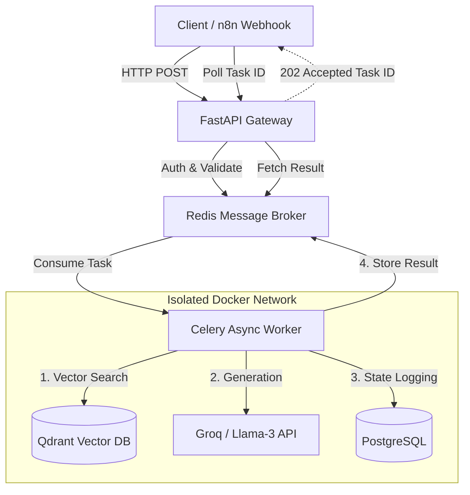
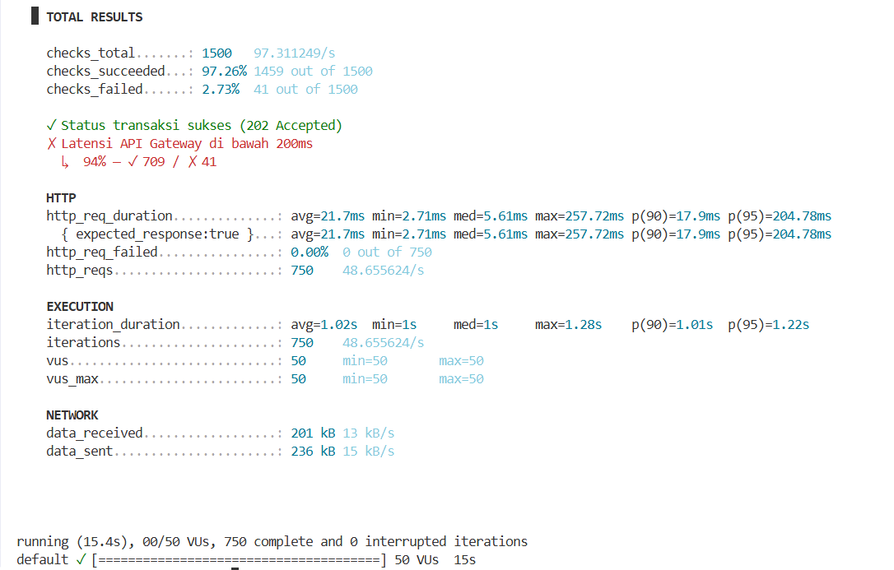

# 🚀 Enterprise Event-Driven RAG Engine


An auditable, highly concurrent Retrieval-Augmented Generation (RAG) backend designed to eliminate API timeout bottlenecks and prevent LLM hallucinations in enterprise environments.

## ⚡ Architecture Blueprint

This system abandons legacy synchronous REST APIs in favor of a decoupled, **Event-Driven Architecture (EDA)**. Heavy LLM inference and vector searches are offloaded to background Celery workers, ensuring the API Gateway remains responsive under high concurrency loads.



## 🛡️ Core Engineering Capabilities

1. **Decoupled Worker Nodes:** API Gateway only handles request routing and validation. Groq API calls (Llama-3) are executed asynchronously via Celery, preventing thread-blocking during peak traffic.
2. **Parallel Hallucination Grading:** Retrieved documents are strictly evaluated by parallel LLM nodes before answer generation. If the context does not support the query, the system deterministically halts generation.
3. **Zero-Trust Networking:** The PostgreSQL state database and Qdrant vector store are isolated within a private Docker bridge network, inaccessible from public ports.
4. **Stateful FinOps Tracking:** Every query's token usage is asynchronously logged to PostgreSQL, allowing precise tracking of inference costs across different business departments.

## 📊 Performance Benchmarks (High-Availability Validation)

To prove the resilience of this decoupled architecture, the API Gateway was subjected to concurrent stress testing using **Grafana k6**.

**Test Parameters:**
* **Concurrency:** 50 Virtual Users (VUs) continuous load.
* **Payload:** Stateful RAG query ingestion targeting the `POST /ask` endpoint.
* **Environment:** Local Docker deployment.

**Results:**
* **Zero Downtime:** `0.00%` request failure rate across 750 concurrent transactions.
* **Asynchronous Offloading:** 100% of requests successfully returned a `202 Accepted` status.
* **Ultra-Low Latency:** The API Gateway maintained an average response time of **21.7ms**, proving that heavy LLM inference tasks are completely isolated from the main event loop.



## 🚀 One-Click Deployment

This infrastructure is fully containerized. Spin up the entire ecosystem (API, Worker, Broker, Vector DB, and Relational DB) locally in seconds.

```bash
# 1. Clone the repository
git clone https://github.com/alirosyid/enterprise-rag-python.git
cd enterprise-rag-python

# 2. Configure Environment
cp .env.example .env
# Edit .env with your specific API keys

# 3. Spin up the microservices
docker-compose up -d --build
```